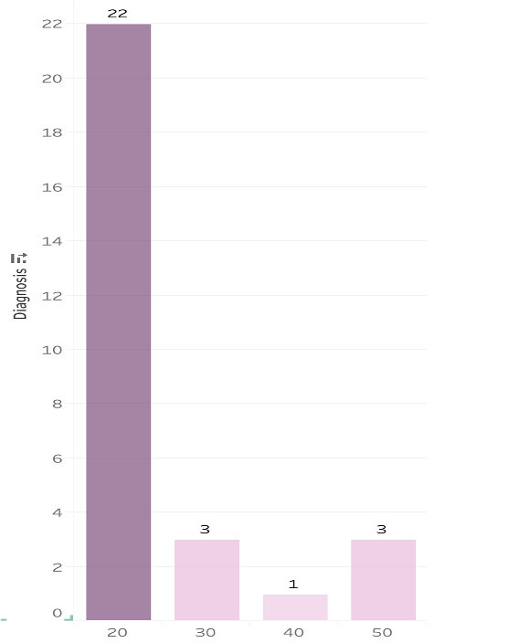
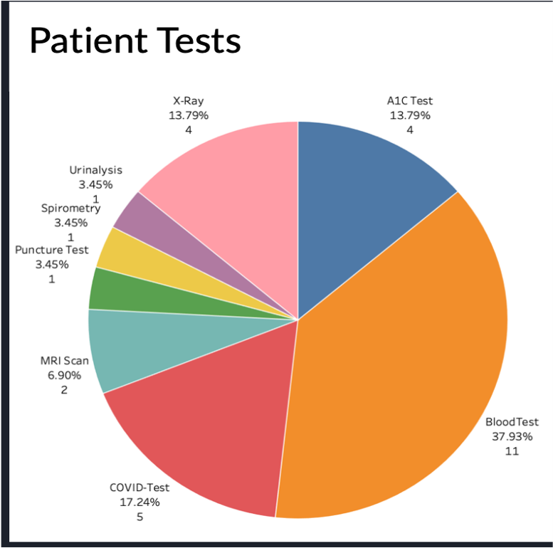

# Hospital Management System(HMS)

## Purpose

Hospital Management System is database designed to provide 
* Automated and seamless management
* Easier tracking of Information
* Eliminating possibilities of errors
* Special focus on COVID-19 
* Aid to better decision making

## Implementation

* Designed and implemented database for Hospital using MySQL.
* Loaded master data and transactional data through SSMS.
* Implemented Stored Procedures, Functions, Triggers, and complex SQL joins to load and manipulate data.
* Modeled ERD diagram.
* Normalized data to 3NF to eradicate data redundancy.
* Integrated it with Tableau to generate dashboard/reports to gain insights from data.

## Entity Relationship Diagram

## Tableau Visualisation

## Design Document

For Design Document check INFO6210-DMDD/HospitalMangementSystem/DesignDocument

Design Document includes
* Database Design Purpose
* Business Problems addressed by HMS database
* Business Rules based on schema's
* Design Requirements
* Design Decisions for implementing database

## Database Implementation

 For all the queries used for implementing database is listed in INFO6210-DMDD/HospitalMangementSystem/DataImplentation.sql

 To execute query, paste in MySQL query browser and click execute button. 

## Final Presentation

For final presentation check INFO6210-DMDD/HospitalMangementSystem/FinalPresentation.pptx

